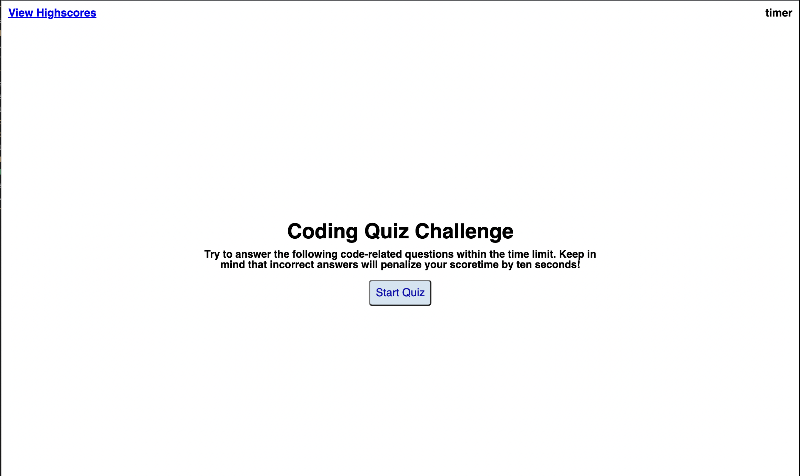

## Time Quiz 
## Objectives 
- make a code quiz
- have a timer that starts when the questions are present 
- when a question is answered incorrectly time is substracted from the clock 
- the game is over when the timer reaches zero or all the questions are answered 
- able to save my initals and my score 

## Link
link to [quiz](https://fiona1nicdao.github.io/Homework_04/)

## preview

# Questions 
Please contact me direclty via the github [fiona1nicdao](<https://github.com/fiona1nicdao>)
